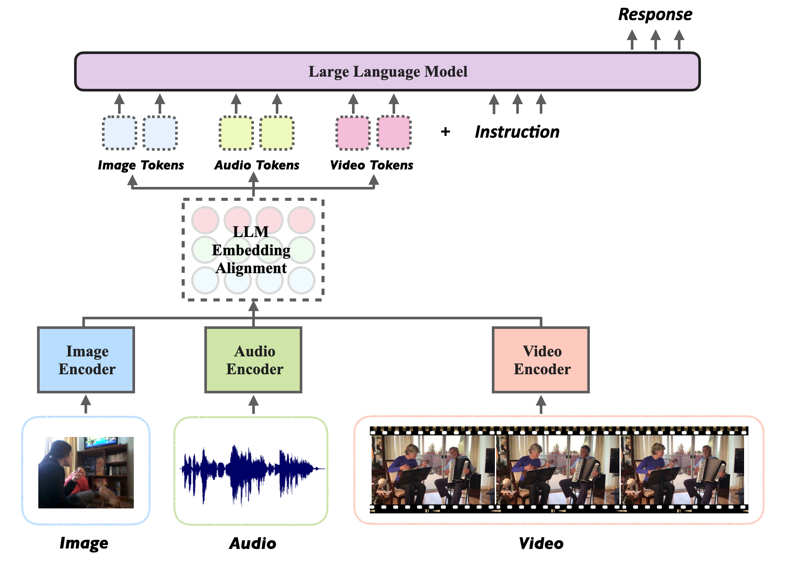
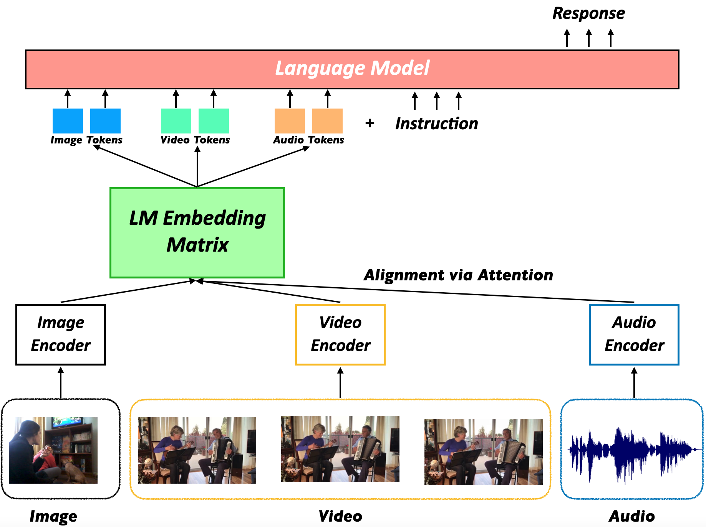
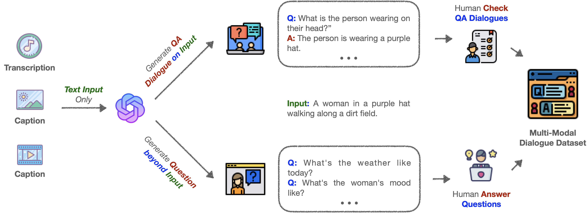
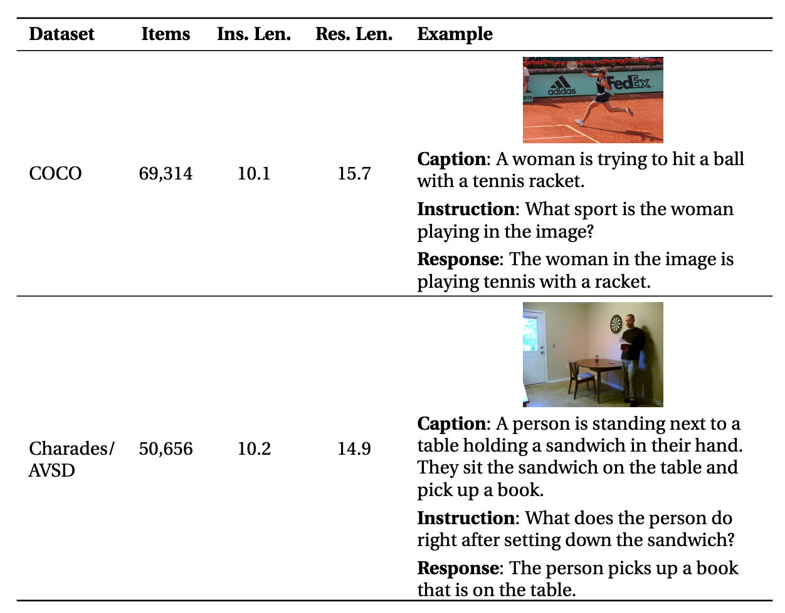

<div align="center">
  
</div>

<div align="center">  &nbsp; &nbsp; &nbsp; &nbsp;  &nbsp; &nbsp; &nbsp; &nbsp;  &nbsp; &nbsp; &nbsp; &nbsp;  &nbsp; &nbsp; &nbsp; &nbsp;  </div>

# Macaw-LLM: Multi-Modal Language Modeling with Image, Audio, Video, and Text Integration


<div align="center">
 


  
  
<!-- **Authors:** -->

**_¹ ² [Chenyang Lyu](https://lyuchenyang.github.io), ³ [Minghao Wu](https://minghao-wu.github.io/), ¹ <sup>*</sup> [Longyue Wang](http://www.longyuewang.com/), ¹ [Xinting Huang](https://timhuang1.github.io/),_**

**_¹ [Bingshuai Liu](bsliu.github.io), ¹ [Zefeng Du](https://seeledu.github.io/index-en.html), ¹ [Shuming Shi](https://shumingshi.github.io/), ¹ [Zhaopeng Tu](http://www.zptu.net/)_**


<!-- **Affiliations:** -->

_¹ Tencent AI Lab, ² Dublin City University, ³ Monash University_

_<sup>*</sup>Longyue Wang is the corresponding author: [vinnlywang@tencent.com](mailto:{vinnlywang@tencent.com)_
</div>


Macaw-LLM is an exploratory endeavor that pioneers multi-modal language modeling by seamlessly combining image🖼️, video📹, audio🎵, and text📝 data, built upon the foundations of CLIP, Whisper, and LLaMA.

#### 📰 <a href="https://tinyurl.com/4rsexudv" style="color: black; text-decoration: underline;text-decoration-style: dotted;">Paper</a>     :building_construction: <a href="https://tinyurl.com/yem9m4nf" style="color: black; text-decoration: underline;text-decoration-style: dotted;">Model (via dropbox)</a>    :building_construction: <a href="https://share.weiyun.com/27EFG2pq" style="color: black; text-decoration: underline;text-decoration-style: dotted;">Model (via weiyun)</a>    :card_file_box: <a href="/data" style="color: black; text-decoration: underline;text-decoration-style: dotted;">Dataset</a>    :bricks: [Code](#usage)    :monocle_face: Video    :technologist: Demo    

## Table of Contents 📚

- [Introduction](#introduction)
- [Key Features](#key-features)
- [Architecture](#architecture)
- [Alignment Strategy](#alignment-strategy)
- [Installation](#installation)
- [Usage](#usage)
- [Future Work and Contributions](#future-work-and-contributions)

## Introduction 
<div align="center">
  
</div>

<!--  -->

In recent years, the field of language modeling has witnessed remarkable advancements. However, the integration of multiple modalities, such as images, videos, audios, and text, has remained a challenging task. Macaw-LLM is a model of its kind, bringing together state-of-the-art models for processing visual, auditory, and textual information, namely CLIP, Whisper, and LLaMA.

## Key Features 🔑

Macaw-LLM boasts the following unique features:

1. **Simple & Fast Alignment**: Macaw-LLM enables seamless integration of multi-modal data through simple and fast alignment to LLM embeddings. This efficient process ensures quick adaptation of diverse data types.
2. **One-Stage Instruction Fine-Tuning**: Our model streamlines the adaptation process through one-stage instruction fine-tuning, promoting a more efficient learning experience.
3. **New Multi-modal Instruction Dataset**: We create a new multi-modal instruction dataset that covers diverse instructional tasks leveraging image and video modalities, which facilitates future work on multi-modal LLMs.


## Architecture 

Macaw-LLM is composed of three main components:

1. **CLIP**: Responsible for encoding images and video frames.
2. **Whisper**: Responsible for encoding audio data.
3. **LLM** (LLaMA/Vicuna/Bloom): The language model that encodes instructions and generates responses.

The integration of these models allows Macaw-LLM to process and analyze multi-modal data effectively.

## Alignment Strategy 

Our novel alignment strategy enables faster adaptation by efficiently bridging multi-modal features to textual features. The process involves:

1. Encoding multi-modal features with CLIP and Whisper.
2. Feeding the encoded features into an attention function, wherein the multi-modal features serve as the query and the embedding matrix of LLaMA as the key and value.
3. Injecting the outputs into the input sequence (before instruction tokens) of LLaMA, allowing for a streamlined alignment process with minimal additional parameters.

## New Multi-modal Instruction Dataset 🆕
<div align="center">
  
</div>
In this project, we generate a dataset using GPT-3.5-Turbo by providing image or video captions as prompts. To create this dataset, we use captions from the MS COCO dataset for images and the Charades and AVSD datasets for videos. Our dataset consists of approximately 69K examples based on COCO image captions and 50K examples based on Charades and AVSD video captions. We currently focus on single-turn dialogues but plan to expand into multi-turn dialogues and diverse multi-modal content in the future. This will enrich the dataset and improve fine-tuning for language learning models (LLMs).
<div align="center">
  
</div>

## Installation 

To install Macaw-LLM, follow these steps:

```bash
# Clone the repository
git clone https://github.com/lyuchenyang/Macaw-LLM.git

# Change to the Macaw-LLM directory
cd Macaw-LLM

# Install required packages
pip install -r requirements.txt

# Install ffmpeg
yum install ffmpeg -y

# Install apex
git clone https://github.com/NVIDIA/apex.git
cd apex
python setup.py install
cd ..
```

## Usage 🚀

1. **Downloading dataset:** 
   - Text data: [stanford_alpaca/alpaca_data.json](https://github.com/tatsu-lab/stanford_alpaca/blob/main/alpaca_data.json) 
   - Image data: [COCO Dataset](https://cocodataset.org/#home) [VQA Dataset](https://visualqa.org/download.html)
   - Video data: [Charades](https://allenai.org/plato/charades/) and [Video Dialog](https://video-dialog.com/)
   - Image instruction data: [Macaw-LLM image instruction dataset](https://github.com/lyuchenyang/Macaw-LLM/blob/main/data/generated_examples_coco.json)
   - Video instruction data: [Macaw-LLM video instruction dataset](https://github.com/lyuchenyang/Macaw-LLM/blob/main/data/generated_examples_avsd.json)

2. **Dataset preprocessing:** 
   - Place the data in three modalities to specific folders - `data/text/`, `data/image/`, `data/video/`
   - Extract frames and audio from videos: 
     ```
     python preprocess_data.py
     ```
   - Transform supervised data to dataset: 
     ```
     python preprocess_data_supervised.py
     ```
   - Transform unsupervised data to dataset: 
     ```
     python preprocess_data_unsupervised.py
     ```

3. **Training:** 
   - Execute the training script (you can specify the training parameters inside):
     ```
     ./train.sh
     ```

4. **Inference:** 
   - Execute the inference script (you can give any customized inputs inside):
     ```
     ./inference.sh
     ```

## Examples 
We present several examples that highlight the proficiency of our Macaw-LLM in understanding and following multi-modal instructions.
These examples showcase our system's multi-modal ability to understand and generate responses based on images and videos. These examples demonstrate how our system comprehends visual content and produces high-quality, fluent responses in natural language conversations. Our system generates contextually relevant and informative answers to various questions about the image, demonstrating its capability to communicate about visual content naturally and fluently.

<div align="center">
  
</div>

## Future Work and Contributions 🚀

While our model is still in its early stages, we believe that Macaw-LLM paves the way for future research in the realm of multi-modal language modeling. The integration of diverse data modalities holds immense potential for pushing the boundaries of artificial intelligence and enhancing our understanding of complex real-world scenarios. By introducing Macaw-LLM, we hope to inspire further exploration and innovation in this exciting area of study.

We welcome contributions from the community to improve and expand Macaw-LLM's capabilities. 🤝

## ToDo 👨‍💻
- [ ] **Evaluation:** We show some examples showcasing the multi-modal ability of our Macaw-LLM. However, we acknowledge that these efforts may not be fully adequate for accurately and comprehensively demonstrate model capabilities. We aim to conduct extensive evaluation on our systems to evaluate its capability.
    
- [ ] **More Language Models:** We aim to extend Macaw-LLM by incorporating additional language models like Dolly, BLOOM, T-5, etc. This will enable more robust and versatile processing and understanding of multi-modal data.

- [ ] **Multilingual Support:** Our next step is to support multiple languages, moving towards true multi-modal and multilingual language models. We believe this will significantly broaden Macaw-LLM's applicability and enhance its understanding of diverse, global contexts.

## Acknowledgements 🙏

We would like to express our gratitude to the following open-source projects for their valuable contributions to Macaw-LLM:

- [Stanford Alpaca](https://github.com/tatsu-lab/stanford_alpaca/) for providing the Alpaca dataset, which we used in our experiments.
- [Parrot](https://github.com/wxjiao/parrot) for providing a helpful implementation of the training of LLaMA.
- [CLIP](https://github.com/openai/CLIP) for providing a strong image and video encoding model.
- [Whisper](https://github.com/s3prl/s3prl) for providing a strong audio encoding model.
- [LLaMA](https://github.com/salesforce/llama) for providing a powerful LLM.

We would also like to thank the developers and maintainers of these projects for their dedication and hard work in making their projects open-source and accessible to the community.


## Citation

```bibtex
@article{lyu2023macaw,
  title={Macaw-LLM: Multi-Modal Language Modeling with Image, Audio, Video, and Text Integration},
  author={Lyu, Chenyang and Wu, Minghao and Wang, Longyue and Huang, Xinting and Liu, Bingshuai and Du, Zefeng and Shi, Shuming and Tu, Zhaopeng},
  journal={arXiv preprint arXiv:2306.09093},
  year={2023}
}
```
